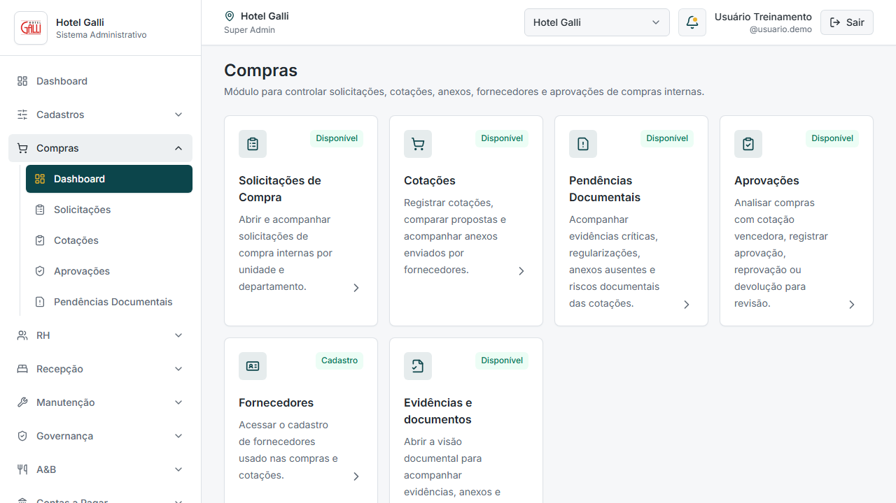
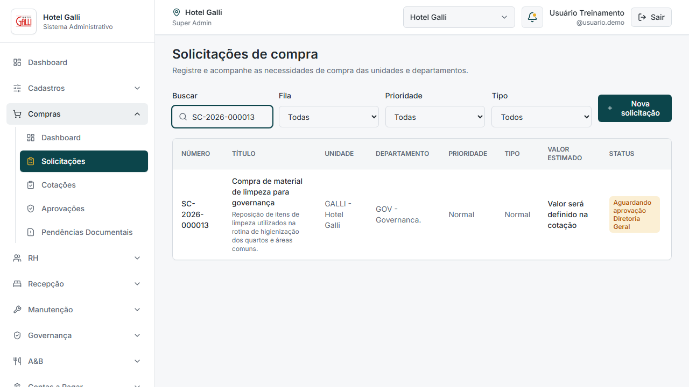
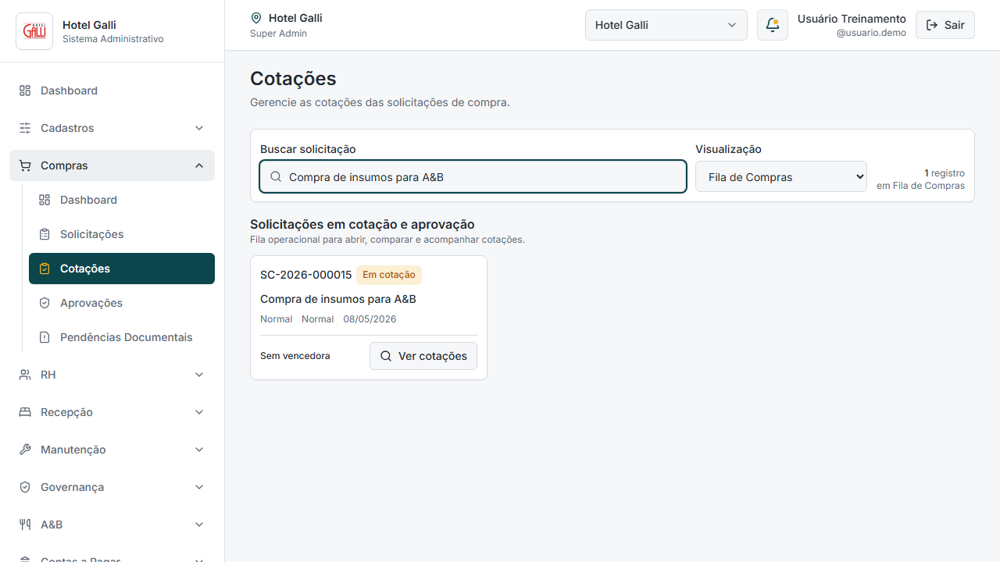
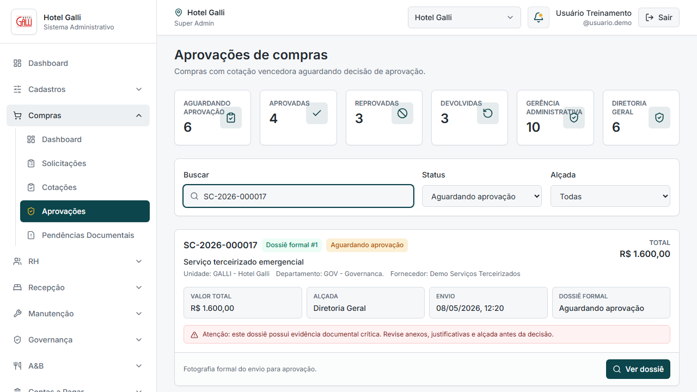
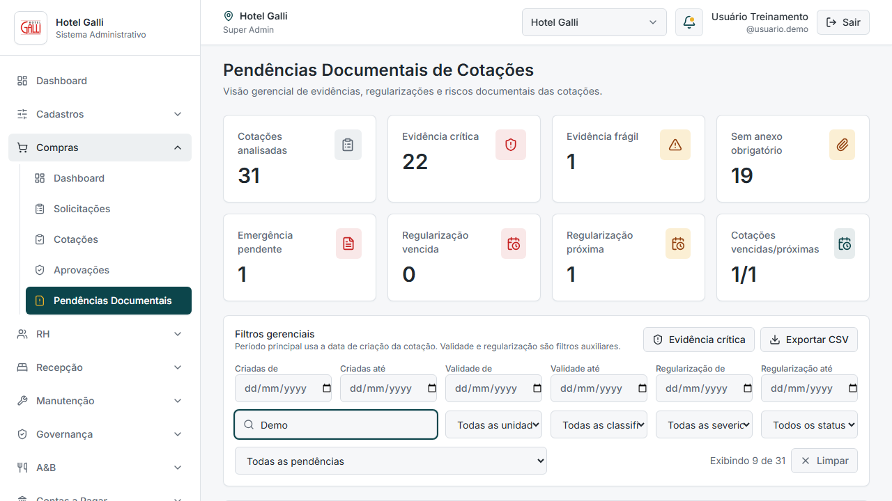

# Manual Operacional do Módulo de Compras

Este manual orienta o uso operacional do módulo de Compras do Sistema Administrativo Hotel Galli. Ele foi escrito para usuários de operação, Compras, Gerência Administrativa, Diretoria da Unidade e Super Admin.

O módulo de Compras organiza solicitações internas, cotações, fornecedores, evidências documentais, seleção de cotação vencedora, dossiê formal e aprovação administrativa da compra.

Importante: este sistema não é PMS e não executa pagamento.

## 1. Objetivo do módulo

O objetivo do módulo de Compras é controlar o fluxo administrativo de compras internas do Hotel Galli, desde a solicitação feita por uma área até a análise documental e a aprovação administrativa.

O módulo ajuda a responder perguntas práticas:

- O que a unidade precisa comprar?
- Quem solicitou?
- Qual é a justificativa?
- Quais fornecedores foram cotados?
- Qual cotação foi escolhida como vencedora?
- A cotação possui evidência documental suficiente?
- O dossiê está pronto para aprovação?
- Existem pendências documentais que precisam de atenção?

O foco é dar rastreabilidade, organização e segurança documental ao processo de compras.

## 2. O que o módulo faz

O módulo permite:

- registrar solicitações de compra;
- acompanhar status das solicitações;
- registrar cotações por fornecedor;
- registrar valores, prazos, validade e condição de pagamento informada pelo fornecedor;
- cadastrar ou localizar fornecedores;
- anexar evidências documentais de cotação;
- classificar a qualidade documental da cotação;
- selecionar uma cotação vencedora;
- formar um dossiê formal para aprovação;
- aprovar, reprovar ou devolver a compra para revisão;
- acompanhar pendências documentais de cotações;
- exportar CSV operacional do painel de pendências.

O módulo organiza a decisão administrativa da compra. Ele não substitui a análise humana, mas mostra informações suficientes para que a decisão seja consciente e rastreável.

## 3. O que o módulo não faz

O módulo de Compras não executa atividades de PMS e não executa pagamento.

Ele não faz:

- reserva;
- check-in;
- check-out;
- controle de tarifas;
- controle de disponibilidade;
- controle de ponto;
- contas a pagar completo;
- agendamento de boleto;
- baixa de título;
- conciliação bancária;
- pagamento automático;
- emissão de relatório auditável formal em PDF.

Aprovar uma compra no sistema não significa pagar. A aprovação valida administrativamente a compra e seu dossiê documental. O pagamento, quando existir, pertence a outro fluxo e não é executado por este módulo.

## 4. Papéis e responsabilidades

| Papel | Responsabilidade | O que pode fazer | O que não deve fazer |
|---|---|---|---|
| Solicitante | Informar a necessidade de compra com clareza. | Criar solicitação, descrever itens, justificar necessidade e acompanhar status. | Criar solicitação incompleta, usar o módulo como pedido de pagamento ou informar dados genéricos demais. |
| Compras | Conduzir cotação e organizar documentação. | Analisar solicitação, registrar fornecedores, lançar cotações, anexar evidências, selecionar vencedora e enviar para aprovação. | Lançar cotação sem fornecedor correto, ignorar evidência frágil, enviar dossiê incompleto ou escolher somente pelo menor preço sem análise. |
| Gerência Administrativa | Avaliar compras dentro da alçada administrativa. | Conferir dossiê, valores, fornecedor, evidências e aprovar, reprovar ou devolver para revisão. | Aprovar sem revisar evidência, tratar aprovação como pagamento ou ignorar pendências críticas. |
| Diretoria da Unidade | Decidir compras de maior valor ou risco documental elevado. | Avaliar alçada, risco, justificativa, fornecedor e continuidade da compra. | Aprovar automaticamente sem analisar o dossiê ou considerar ranking documental como avaliação formal de fornecedor. |
| Super Admin | Administrar visão ampla e acessos do sistema. | Acompanhar o módulo, apoiar auditoria interna e validar configuração operacional. | Substituir o fluxo operacional das áreas ou usar permissões para contornar análise documental. |

## 5. Fluxo geral da compra

O fluxo operacional recomendado é:

1. A área cria uma solicitação de compra.
2. Compras analisa a solicitação.
3. Compras registra cotações com fornecedores.
4. Compras informa origem e evidência documental da cotação.
5. Compras anexa documentos quando necessário.
6. O sistema classifica a evidência documental.
7. Compras compara as cotações.
8. Compras seleciona a cotação vencedora.
9. A compra é enviada para aprovação, formando um dossiê formal.
10. Gerência Administrativa ou Diretoria revisa o dossiê.
11. O aprovador aprova, devolve para revisão ou reprova.
12. Pendências documentais continuam disponíveis para acompanhamento gerencial.

Cada etapa deve ser feita com cuidado. A qualidade da aprovação depende da qualidade da solicitação, das cotações e das evidências registradas.

## 6. Dashboard de Compras

O Dashboard de Compras é a porta de entrada do módulo. Ele reúne atalhos para as principais telas:

- Solicitações de Compra;
- Cotações;
- Pendências Documentais;
- Aprovações;
- Fornecedores;
- Evidências e documentos.

Quem deve usar:

- Compras, para navegar rapidamente entre etapas;
- Gerência e Diretoria, para acessar aprovações e pendências;
- Super Admin, para verificar se o módulo está organizado.

Cuidados:

- O dashboard é navegação, não é relatório final.
- Cards disponíveis indicam áreas operacionais do módulo.
- Para análise documental, use Pendências Documentais.
- Para decisão administrativa, use Aprovações.

## 7. Solicitações de Compra

Solicitação de compra é o início do processo. Ela descreve a necessidade de uma área antes da cotação com fornecedores.

### 7.1 Quando criar uma solicitação

Crie uma solicitação quando uma área precisar comprar material, contratar serviço ou repor item operacional.

Exemplos:

- material de limpeza;
- lâmpadas e itens de manutenção;
- insumos de A&B;
- equipamento de apoio;
- serviço terceirizado emergencial.

Não use solicitação de compra para pedir pagamento. A solicitação informa necessidade operacional, não autoriza desembolso financeiro.

### 7.2 Como preencher uma solicitação

Preencha os campos com clareza:

- título: resumo objetivo da necessidade;
- unidade: unidade responsável pela compra;
- departamento: área solicitante;
- prioridade: baixa, normal, alta ou crítica, conforme urgência;
- tipo: normal ou emergencial;
- justificativa: por que a compra é necessária.

Um bom título ajuda Compras a localizar a solicitação. Uma boa justificativa ajuda Gerência e Diretoria a entenderem a necessidade no momento da aprovação.

### 7.3 Como preencher os itens

Cada item deve informar:

- descrição;
- quantidade;
- unidade de medida;
- observação operacional, quando necessário.

Evite itens genéricos como "diversos" ou "material". Escreva o que precisa ser comprado de forma suficiente para permitir cotação.

Exemplo bom:

- "Lâmpada LED 12W branco frio - 40 unidades - corredores".

Exemplo ruim:

- "Lâmpadas".

### 7.4 Como salvar ou enviar

Quando o formulário ainda não estiver completo, salve como rascunho se essa opção estiver disponível.

Quando a solicitação estiver pronta, envie para o fluxo de compras. Depois do envio, Compras poderá iniciar ou acompanhar a cotação.

Antes de enviar, confirme:

- título claro;
- departamento correto;
- prioridade correta;
- justificativa preenchida;
- itens completos.

### 7.5 Como acompanhar status

A tela de Solicitações permite acompanhar o status da solicitação.

Status comuns indicam se a solicitação:

- está aguardando tratamento;
- está em cotação;
- está aguardando aprovação;
- foi devolvida;
- foi finalizada.

Se a solicitação estiver aguardando aprovação, o próximo passo pertence ao aprovador. Se estiver devolvida, Compras deve revisar o que foi solicitado.

## 8. Fornecedores

Fornecedor é a empresa ou pessoa que apresenta cotação para a compra.

### 8.1 Quando cadastrar fornecedor

Cadastre fornecedor quando ele ainda não existir na base e for necessário registrar cotação.

Antes de cadastrar, pesquise por:

- razão social;
- nome fantasia;
- documento;
- telefone;
- e-mail.

Isso evita duplicidade e melhora a rastreabilidade.

### 8.2 Cadastro completo de fornecedor

Use o cadastro completo quando houver tempo para preencher os dados principais do fornecedor.

Dados recomendados:

- razão social;
- nome fantasia;
- tipo de pessoa;
- documento;
- telefone;
- e-mail;
- cidade e UF;
- segmento ou categoria;
- observação.

Fornecedor cadastrado corretamente facilita futuras cotações e evita confusão entre empresas parecidas.

### 8.3 Cadastro rápido durante cotação

O cadastro rápido pode ser usado quando Compras está registrando uma cotação e percebe que o fornecedor ainda não existe.

Use com cuidado:

- preencha dados mínimos corretos;
- evite abreviações confusas;
- registre contato válido;
- depois revise o cadastro completo, se necessário.

Cadastro rápido não deve virar cadastro incompleto permanente.

### 8.4 Cuidados com fornecedores duplicados

Fornecedor duplicado prejudica o histórico e o ranking documental.

Antes de criar um novo fornecedor:

- pesquise por nome fantasia;
- pesquise por razão social;
- verifique documento;
- confirme se já existe fornecedor parecido.

Se houver dúvida, peça revisão antes de cadastrar novamente.

## 9. Cotações

Cotação é o registro da proposta ou informação de preço recebida de um fornecedor.

### 9.1 Quando lançar cotação

Lance cotação quando a solicitação estiver pronta para receber propostas ou informações de fornecedores.

Uma solicitação pode ter mais de uma cotação. O ideal é comparar alternativas antes de selecionar vencedora.

### 9.2 Como escolher a solicitação

Na tela de Cotações, localize a solicitação pelo número, título ou busca.

Antes de registrar cotação, confirme:

- a solicitação correta;
- os itens solicitados;
- a prioridade;
- se a compra é normal ou emergencial.

Não lance cotação em solicitação errada. Isso pode comprometer o dossiê e a aprovação.

### 9.3 Como selecionar fornecedor

Selecione o fornecedor correto na cotação.

Confira:

- razão social;
- nome fantasia;
- documento, quando disponível;
- telefone ou e-mail.

Se o fornecedor não existir, use o cadastro correto ou o cadastro rápido, conforme o caso.

### 9.4 Como preencher valores, prazo e condição de pagamento

Registre:

- valor total da cotação;
- prazo de entrega ou execução;
- validade da cotação;
- condição de pagamento informada pelo fornecedor.

A condição de pagamento aqui é informativa. Ela não executa pagamento, não agenda boleto e não cria contas a pagar.

Revise valores com atenção. Erro de digitação pode levar a uma decisão administrativa errada.

### 9.5 Como registrar origem da cotação

A origem indica de onde veio a informação da cotação.

Exemplos:

- proposta formal;
- e-mail;
- WhatsApp;
- site ou catálogo;
- ligação;
- presencial;
- emergência.

Registrar a origem é obrigatório para entender a força documental da cotação.

### 9.6 Como anexar evidências

Anexe evidências sempre que possível.

Exemplos de evidência:

- PDF de proposta;
- e-mail formal;
- print de WhatsApp;
- catálogo com URL;
- documento recebido do fornecedor.

Anexo errado, incompleto ou ausente pode transformar uma cotação em pendência documental.

### 9.7 Como interpretar a classificação documental

O sistema classifica a cotação conforme a qualidade da evidência:

- Formal suficiente;
- Aceitável com ressalva;
- Frágil;
- Crítica.

A classificação não aprova nem reprova automaticamente a compra. Ela orienta a análise e mostra o nível de cuidado necessário antes da decisão.

## 10. Evidências e anexos

Evidência documental é o registro que sustenta a cotação. Ela protege Compras, aprovadores e a unidade.

### 10.1 O que é evidência formal

Evidência formal é o registro mais forte.

Exemplos:

- proposta em PDF;
- e-mail com proposta;
- documento formal anexado;
- arquivo enviado pelo fornecedor.

Quando a evidência é formal suficiente, o processo fica mais claro e mais seguro.

### 10.2 O que é evidência aceitável com ressalva

É uma evidência que pode ser usada, mas exige atenção.

Exemplos:

- WhatsApp com print;
- site ou catálogo com URL;
- fornecedor recorrente com referência mínima.

Aceitável com ressalva não equivale a proposta formal completa. O aprovador deve entender a limitação.

### 10.3 O que é evidência frágil

Evidência frágil é aquela que registra alguma informação, mas com pouca força documental.

Exemplos:

- ligação com anotação;
- WhatsApp sem print;
- cotação sem anexo, mas com justificativa;
- relato com dados mínimos.

Quando a evidência é frágil, Compras deve justificar e, se possível, regularizar.

### 10.4 O que é evidência crítica

Evidência crítica indica risco documental elevado.

Pode acontecer quando:

- origem ou tipo de evidência não foi informado;
- não há evidência formal;
- não há justificativa suficiente;
- emergência não possui documentação mínima;
- site ou catálogo não possui URL, anexo ou justificativa.

Evidência crítica exige análise gerencial ou da Diretoria. Ela não impede automaticamente a compra, mas exige decisão consciente.

### 10.5 Quando o anexo é obrigatório

O anexo deve ser tratado como obrigatório quando a origem ou o tipo de evidência depende de documento para comprovação.

Exemplos:

- proposta formal;
- WhatsApp usado como evidência;
- catálogo que precisa de print ou arquivo;
- cotação com risco documental.

Se o anexo ainda não existir, registre justificativa e acompanhe a regularização.

### 10.6 Como tratar cotação verbal, WhatsApp, catálogo e emergência

Cotação verbal:

- registre contato, data, canal e justificativa;
- use apenas quando não houver alternativa melhor;
- regularize com documento assim que possível.

WhatsApp:

- anexe print da conversa;
- registre fornecedor e contato;
- não use apenas relato informal se o valor ou risco for relevante.

Catálogo ou site:

- registre URL;
- anexe print ou documento quando necessário;
- confirme validade e condições.

Emergência:

- registre motivo da urgência;
- informe regularização necessária;
- defina prazo de regularização;
- encaminhe para análise com transparência.

## 11. Seleção da cotação vencedora

Selecionar vencedora é indicar qual cotação Compras recomenda para continuidade da compra.

### 11.1 O que significa selecionar vencedora

Significa que aquela cotação será usada como base para o dossiê formal e para a aprovação administrativa.

Ao selecionar vencedora, Compras informa ao aprovador qual fornecedor e qual valor estão sendo recomendados.

### 11.2 O que observar antes de selecionar

Antes de selecionar, confira:

- fornecedor correto;
- valor total;
- prazo de entrega;
- condição informada;
- validade da cotação;
- origem da cotação;
- evidência documental;
- anexos;
- classificação documental;
- justificativas.

### 11.3 Diferença entre menor preço e melhor decisão

Menor preço nem sempre é a melhor decisão.

Considere:

- confiabilidade documental;
- prazo;
- validade;
- urgência;
- qualidade da evidência;
- risco de comprar sem comprovação adequada.

Uma cotação mais barata com evidência crítica pode exigir mais cuidado do que uma cotação um pouco maior com proposta formal clara.

### 11.4 Cuidados antes de enviar para aprovação

Antes de enviar para aprovação:

- confirme se a vencedora está correta;
- revise se há anexo obrigatório;
- leia alertas documentais;
- confirme justificativas;
- verifique se a compra está pronta para análise.

Não envie dossiê incompleto quando a regularização puder ser feita antes.

## 12. Dossiê formal

Dossiê formal é a fotografia administrativa da compra no momento em que ela é enviada para aprovação.

### 12.1 O que é o dossiê formal

É o conjunto de informações que será analisado pelo aprovador.

Ele mostra:

- solicitação;
- itens;
- cotações;
- cotação vencedora;
- fornecedor;
- valor;
- evidências;
- anexos;
- classificação documental;
- alçada;
- status da aprovação.

### 12.2 O que fica registrado no dossiê

O dossiê registra as informações necessárias para a decisão administrativa.

O aprovador deve decidir com base no que está no dossiê. Por isso, Compras deve revisar o conteúdo antes de enviar.

### 12.3 Por que o dossiê protege o processo

O dossiê protege o processo porque cria uma referência clara do que foi apresentado para aprovação.

Ele reduz risco de decisão sem contexto e facilita consulta posterior.

### 12.4 Quando o dossiê vai para aprovação

O dossiê vai para aprovação quando:

- há cotação vencedora selecionada;
- a solicitação está pronta;
- as informações principais foram preenchidas;
- Compras entende que a compra pode ser analisada.

Enviar para aprovação não significa aprovar. Significa colocar o dossiê para decisão.

## 13. Aprovação administrativa da compra

Aprovação administrativa é a decisão sobre continuidade da compra com base no dossiê formal.

### 13.1 Quem aprova

A aprovação pode ser analisada pela Gerência Administrativa ou pela Diretoria, conforme alçada e risco documental.

Compras não deve contornar alçada. Se o sistema indicar Diretoria, o dossiê deve ser tratado com esse nível de atenção.

### 13.2 O que o aprovador deve verificar

O aprovador deve revisar:

- solicitação e justificativa;
- itens;
- fornecedor vencedor;
- valor;
- prazo;
- evidências;
- anexos;
- classificação documental;
- alertas de evidência crítica ou frágil;
- alçada;
- eventuais pendências.

Se algo estiver incompleto, o caminho adequado pode ser devolver para Compras.

### 13.3 Aprovar

Aprovar significa validar administrativamente a continuidade da compra.

Antes de aprovar, confirme:

- o dossiê está claro;
- a vencedora faz sentido;
- a evidência é suficiente ou a ressalva foi compreendida;
- a alçada está adequada;
- não há dúvida relevante sem resposta.

Aprovar não executa pagamento.

### 13.4 Devolver para Compras

Devolver para Compras significa pedir correção, complemento ou revisão.

Use quando:

- falta evidência;
- falta anexo;
- há divergência de valor;
- a justificativa está fraca;
- a cotação vencedora não está clara;
- existe pendência documental que precisa ser regularizada.

Ao devolver, informe claramente o que Compras precisa revisar.

### 13.5 Reprovar

Reprovar significa negar a continuidade da compra naquele dossiê.

Use quando:

- a compra não se justifica;
- o risco é alto demais;
- a documentação não sustenta a decisão;
- a solicitação não está adequada;
- a compra deve ser refeita.

Registre justificativa objetiva.

### 13.6 O que a aprovação não faz

A aprovação administrativa não:

- paga fornecedor;
- agenda boleto;
- baixa título;
- cria contas a pagar completo;
- faz conciliação bancária;
- substitui financeiro;
- substitui contrato, nota fiscal ou documento oficial exigido por outro processo.

Aprovação é controle administrativo da compra, não pagamento.

## 14. Pendências Documentais

O painel de Pendências Documentais apoia gestão e auditoria operacional das cotações.

### 14.1 Objetivo do painel

O objetivo é mostrar riscos documentais nas cotações.

O painel ajuda a identificar:

- evidências críticas;
- evidências frágeis;
- ausência de anexo obrigatório;
- emergência com regularização pendente;
- regularização vencida ou próxima;
- cotação vencida ou próxima do vencimento;
- fornecedores com mais pendências documentais.

### 14.2 Cards de resumo

Os cards mostram indicadores gerais do período e dos filtros aplicados.

Exemplos:

- cotações analisadas;
- evidência crítica;
- evidência frágil;
- sem anexo obrigatório;
- emergência pendente;
- regularização vencida;
- regularização próxima;
- cotações vencidas ou próximas.

Use os cards para priorizar análise, não para aprovar automaticamente.

### 14.3 Filtros

Os filtros permitem reduzir a lista por:

- data de criação;
- validade;
- regularização;
- unidade;
- classificação documental;
- severidade;
- status;
- pendência específica;
- busca textual.

Use filtros para investigar uma unidade, fornecedor, período ou tipo de risco.

### 14.4 Visão por unidade

A visão por unidade ajuda Super Admin, Gerência e Diretoria a entenderem onde estão concentradas as pendências.

Ela não deve ser usada para punição automática. Deve orientar acompanhamento, treinamento e melhoria do processo.

### 14.5 Ranking de pendências

O ranking de pendências mostra quais tipos de problema aparecem mais.

Exemplos:

- sem anexo obrigatório;
- evidência crítica;
- cotação vencida;
- regularização próxima.

Use esse ranking para decidir onde melhorar o processo.

### 14.6 Fornecedores com mais pendências documentais

Esse ranking mostra fornecedores associados a mais pendências documentais.

Importante: ranking de fornecedor não é avaliação formal de desempenho.

Ele não significa que o fornecedor é ruim. Ele indica que há mais registros documentais a revisar ou regularizar naquele conjunto de cotações.

### 14.7 Tabela detalhada

A tabela detalhada mostra cotação, solicitação, fornecedor, unidade, valor, validade, classificação e pendências.

Use a tabela para investigar casos específicos antes de acionar Compras ou solicitar regularização.

### 14.8 Filtro de evidência crítica

O filtro de evidência crítica destaca os casos com maior risco documental.

Use semanalmente para revisar:

- emergências sem evidência formal;
- cotações sem dados essenciais;
- casos que exigem análise da Diretoria;
- regularizações pendentes.

### 14.9 Exportação CSV

O botão Exportar CSV gera uma exportação operacional dos dados filtrados.

CSV serve para análise operacional. Ele não é relatório auditável formal, não substitui documentos oficiais e não deve ser tratado como dossiê de aprovação.

Antes de compartilhar CSV:

- confirme filtros aplicados;
- verifique se há dados sensíveis;
- use apenas em contexto interno autorizado.

## 15. Boas práticas

- Nunca lance cotação sem fornecedor correto.
- Evite fornecedor duplicado.
- Sempre anexe evidência quando houver documento.
- Não use conversa verbal como evidência final sem justificativa.
- Revise validade da cotação.
- Revise valores, prazo e condição informada.
- Não selecione vencedora só pelo menor preço se houver risco documental.
- Não envie dossiê incompleto para aprovação.
- Não trate aprovação como pagamento.
- Use Pendências Documentais semanalmente.
- Registre justificativas claras em casos de emergência.
- Regularize evidências frágeis ou críticas sempre que possível.
- Confira se a cotação vencida ainda pode ser usada antes de seguir.
- Mantenha linguagem objetiva nas observações.

## 16. Erros comuns e como evitar

| Erro comum | Risco | Como evitar |
|---|---|---|
| Esquecer anexo obrigatório | Cotação vira pendência documental. | Anexar proposta, print ou documento antes de enviar para aprovação. |
| Informar origem verbal sem justificativa | Evidência pode ser frágil ou crítica. | Registrar contato, motivo e regularização prevista. |
| Anexar arquivo errado | A aprovação pode se basear em documento incorreto. | Conferir o arquivo antes de salvar. |
| Lançar valor incorreto | Pode causar decisão errada. | Revisar valor total e itens antes de selecionar vencedora. |
| Confundir solicitação com cotação | O fluxo fica incompleto. | Solicitação descreve necessidade; cotação registra proposta do fornecedor. |
| Confundir aprovação com pagamento | Pode gerar expectativa financeira indevida. | Reforçar que aprovação é administrativa e não paga fornecedor. |
| Usar fornecedor real em teste | Mistura treinamento com operação. | Usar fornecedores demo em treinamento. |
| Não revisar evidência crítica | Compra pode seguir sem análise adequada. | Usar filtro de evidência crítica e revisar antes da decisão. |
| Ignorar cotação vencida | A proposta pode não estar mais válida. | Conferir validade antes de selecionar vencedora. |
| Exportar CSV como relatório auditável | Pode gerar interpretação errada. | Usar CSV apenas como apoio operacional. |

## 17. Checklists operacionais

### 17.1 Checklist do solicitante

- [ ] O título está claro?
- [ ] A unidade está correta?
- [ ] O departamento está correto?
- [ ] A prioridade corresponde à necessidade?
- [ ] A justificativa explica o motivo da compra?
- [ ] Todos os itens foram preenchidos?
- [ ] Quantidades e unidades de medida estão corretas?
- [ ] A solicitação não está sendo usada como pedido de pagamento?

### 17.2 Checklist de Compras

- [ ] A solicitação está clara?
- [ ] Todos os itens foram preenchidos?
- [ ] Existem cotações suficientes?
- [ ] O fornecedor está corretamente identificado?
- [ ] A origem da cotação foi informada?
- [ ] A evidência foi anexada?
- [ ] A validade da cotação está vigente?
- [ ] A condição de pagamento foi preenchida como informação da cotação?
- [ ] A cotação vencedora foi selecionada conscientemente?
- [ ] Existe justificativa quando a evidência for frágil ou crítica?
- [ ] O dossiê está pronto para aprovação?

### 17.3 Checklist da Gerência Administrativa

- [ ] O dossiê formal está completo?
- [ ] A solicitação está justificada?
- [ ] A cotação vencedora faz sentido?
- [ ] O valor está coerente?
- [ ] As evidências foram revisadas?
- [ ] Há alerta de evidência frágil ou crítica?
- [ ] A decisão não está sendo confundida com pagamento?
- [ ] Se houver dúvida, a compra deve ser devolvida para Compras?

### 17.4 Checklist da Diretoria

- [ ] A compra está dentro de um contexto operacional claro?
- [ ] O valor exige decisão da Diretoria?
- [ ] Há risco documental relevante?
- [ ] A evidência crítica foi analisada?
- [ ] A emergência está justificada?
- [ ] Existe prazo de regularização, quando necessário?
- [ ] A decisão está registrada de forma objetiva?

### 17.5 Checklist do Super Admin

- [ ] Os usuários têm acesso adequado às unidades?
- [ ] O módulo está sendo usado como fluxo de compras, não como financeiro completo?
- [ ] Há fornecedores duplicados recorrentes?
- [ ] Pendências Documentais estão sendo acompanhadas?
- [ ] Os dados demo não estão misturados com operação real?
- [ ] O manual e os screenshots estão atualizados?

## 18. Glossário

| Termo | Significado |
|---|---|
| Solicitação de compra | Registro da necessidade de compra feita por uma área. |
| Cotação | Proposta ou informação de preço registrada para uma solicitação. |
| Fornecedor | Empresa ou pessoa que fornece produto ou serviço cotado. |
| Evidência | Informação que sustenta a cotação. |
| Anexo | Arquivo usado como evidência documental. |
| Evidência formal suficiente | Proposta, e-mail ou documento com força suficiente para sustentar a cotação. |
| Aceitável com ressalva | Evidência utilizável, mas que exige atenção por não ser formal completa. |
| Evidência frágil | Evidência com pouca força documental, normalmente exigindo justificativa. |
| Evidência crítica | Evidência de alto risco documental, exigindo análise cuidadosa. |
| Regularização | Complementação documental posterior de uma cotação. |
| Cotação vencida | Cotação cuja validade expirou. |
| Cotação vencedora | Cotação escolhida por Compras para seguir no dossiê. |
| Dossiê formal | Registro formal da compra enviado para aprovação administrativa. |
| Alçada | Nível responsável pela decisão, como Gerência Administrativa ou Diretoria. |
| Aprovação administrativa | Decisão de aprovar, reprovar ou devolver a compra com base no dossiê. |
| Pendência documental | Problema ou alerta relacionado à evidência da cotação. |
| CSV operacional | Arquivo de apoio para análise operacional, sem valor de relatório auditável formal. |

## 19. Observações finais

O módulo de Compras deve ser usado para organizar o processo administrativo de compras internas com segurança documental.

As principais regras são:

- solicitação bem preenchida evita retrabalho;
- cotação sem evidência adequada aumenta risco;
- dossiê formal deve estar claro antes da aprovação;
- aprovação administrativa não é pagamento;
- ranking de fornecedor é documental, não avaliação formal de desempenho;
- CSV é apoio operacional, não relatório auditável;
- o sistema não é PMS e não executa rotinas de reservas, check-in, check-out, tarifas ou disponibilidade.

Em caso de dúvida, prefira registrar justificativa, anexar evidência e devolver para revisão antes de aprovar uma compra sem documentação suficiente.
